# IPL Data Analysis

This repository contains a comprehensive analysis of Indian Premier League (IPL) data, based on three primary datasets: `ipl_matching`, `ipl_batting`, and `ipl_deliveries`. Two additional datasets, `batsmen_info` and `team_info`, were created to enhance the analysis. Visualizations and insights were generated using Power BI. All datasets are located in the `data` folder.

## Repository Structure

├── data/
│ ├── ipl_matching.csv
│ ├── ipl_batting.csv
│ ├── ipl_deliveries.csv
│ ├── batsmen_info.csv
│ └── team_info.csv
├── docs/
│ ├── 1.png
│ ├── 2.png
│ ├── 3.png
│ ├── 4.png
│ ├── 5.png
│ ├── 6.png
│ ├── 7.png
│ ├── 8.png
│ ├── 9.png
│ ├── 10.png
│ ├── 11.png
│ ├── 12.png
│ ├── 13.png
│ ├── 14.png
├── README.md
└── analysis_report.pbi

## Datasets

- **ipl_matching.csv**: Match details including teams, results, and venue information.
- **ipl_batting.csv**: Batting statistics such as runs scored, player names, and batting order.
- **ipl_deliveries.csv**: Ball-by-ball data for each match.
- **batsmen_info.csv**: Summarized batting statistics across seasons.
- **team_info.csv**: Summarized team performance statistics.

## Analysis and Visualizations

### IPL Matches Analysis

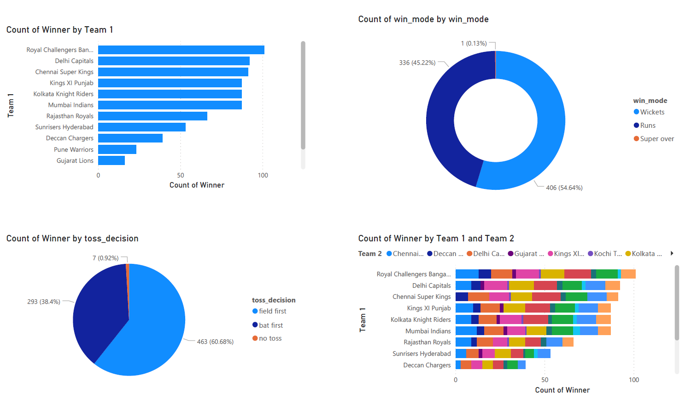
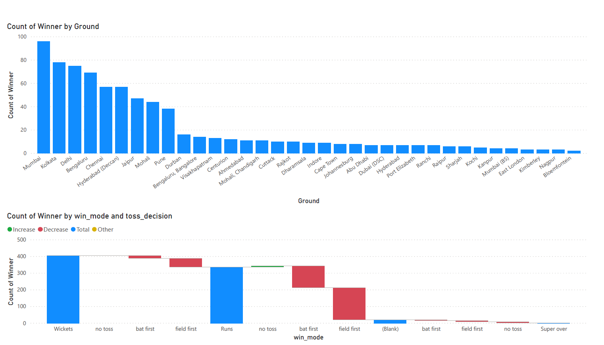

#### Insights
1. **Most Winning Team Fielding First**: Teams that fielded first often won their matches.
2. **Common Winning Mode**: Winning by wickets was more common than winning by runs.
3. **Popular Venues**: Most matches were won at grounds in Mumbai.

### IPL Batting Analysis

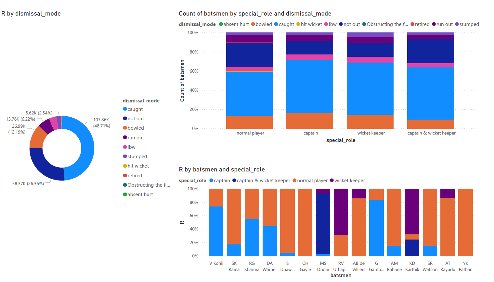
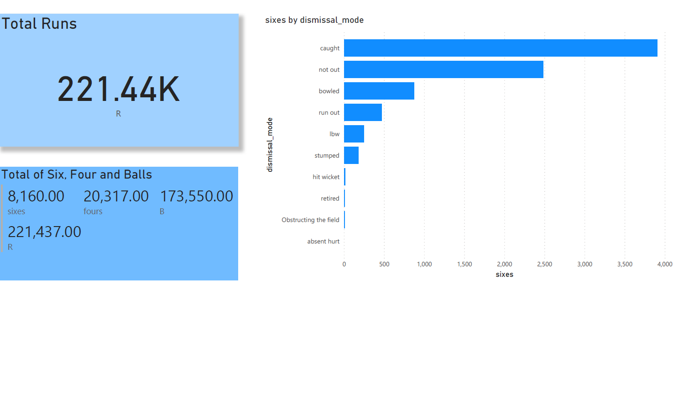
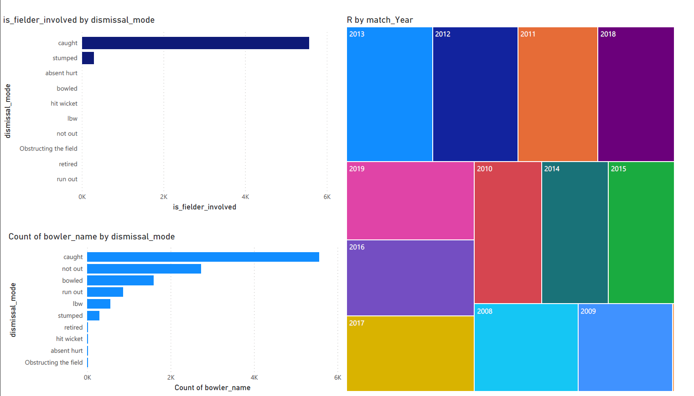
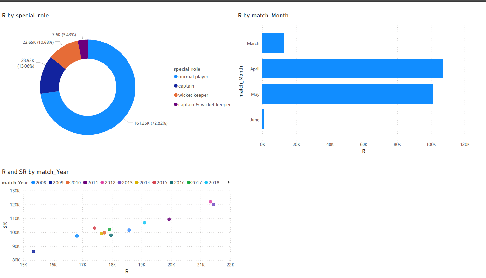

#### Insights
1. **Total Runs**: Across all seasons, a total of 221.44K runs were scored.
2. **Wicket Types**: Most wickets were taken by caught and out.
3. **Run Contributions**: Normal players (non-all-rounders) contributed the majority of runs.
4. **Monthly Performance**: The maximum runs were scored in April.
5. **Sixes**: Most sixes were hit by batsmen who were caught and out.
6. **Dismissals**: A significant number of runs were scored by batsmen who were caught and out.

### IPL Deliveries Analysis

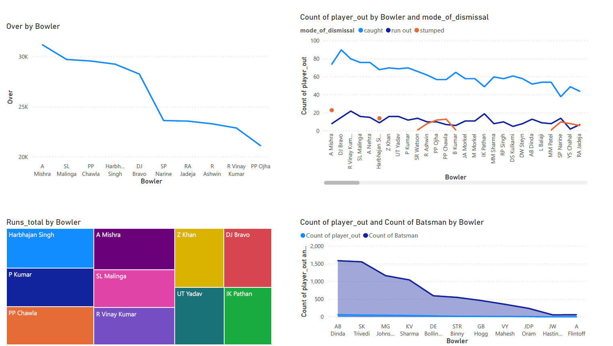
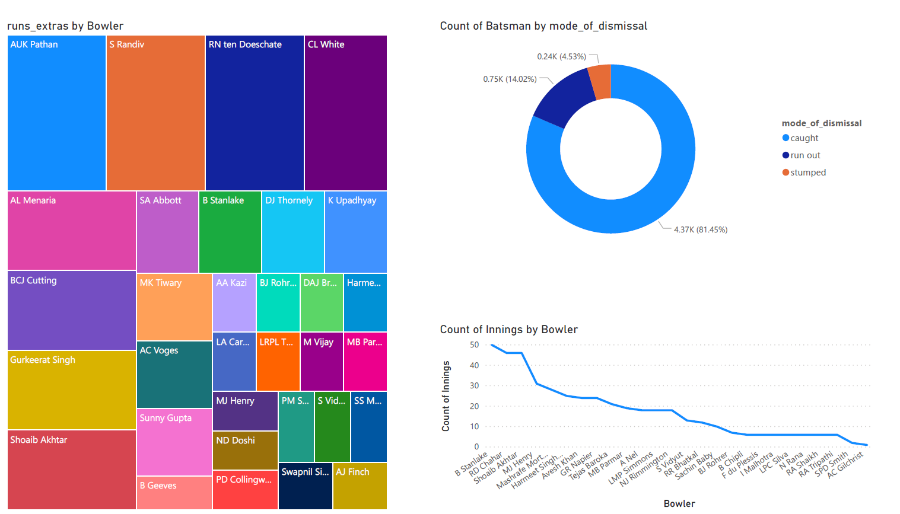
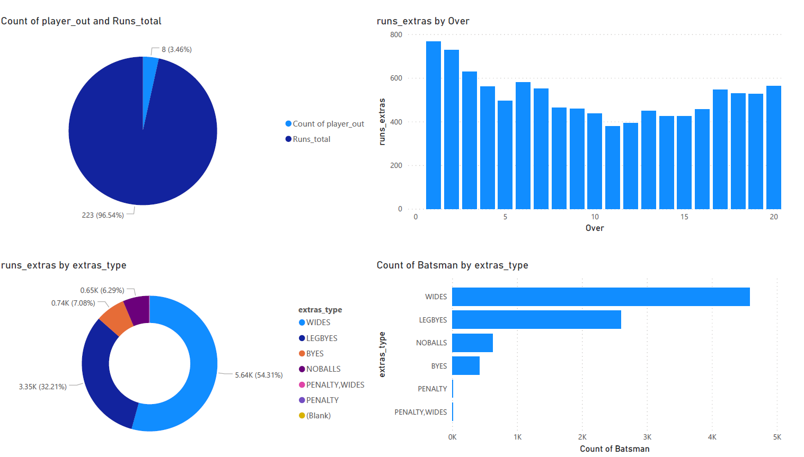

#### Insights
1. **Common Extra Type**: Wides were the most common type of extra run.
2. **Extra Runs by Over**: The first over had the most extra runs.
3. **Top Extra Runs Conceder**: AUK Pathan conceded the most extra runs.

### Team Information Analysis

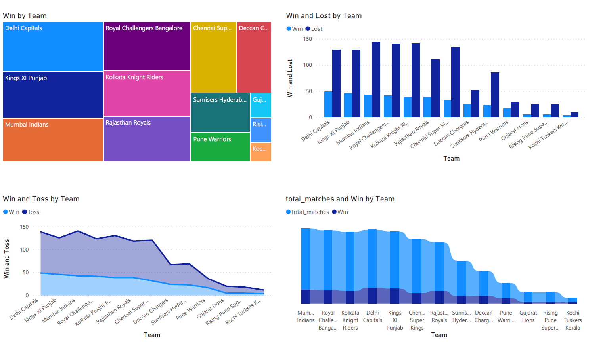
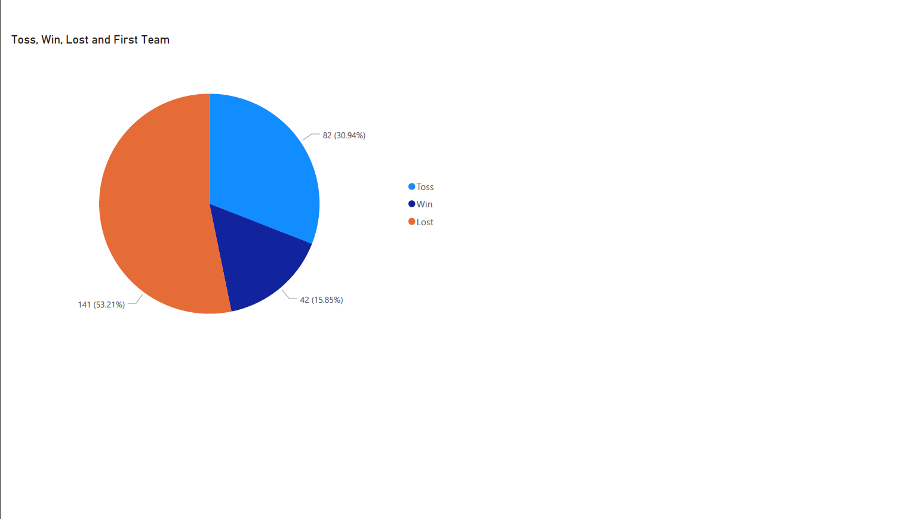

#### Insights
1. **Top Team**: Delhi Capitals won the maximum number of matches.

### Batsmen Information Analysis

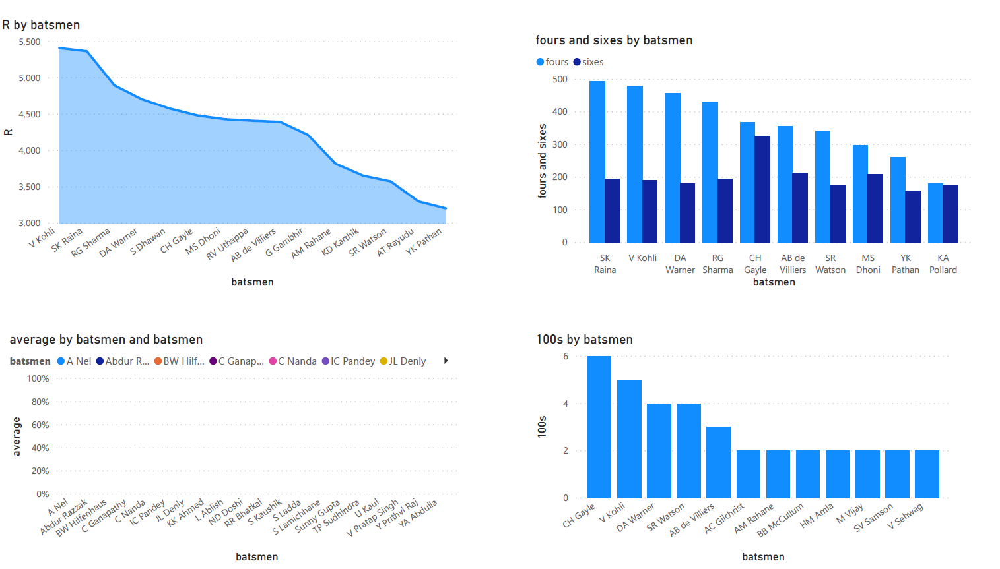
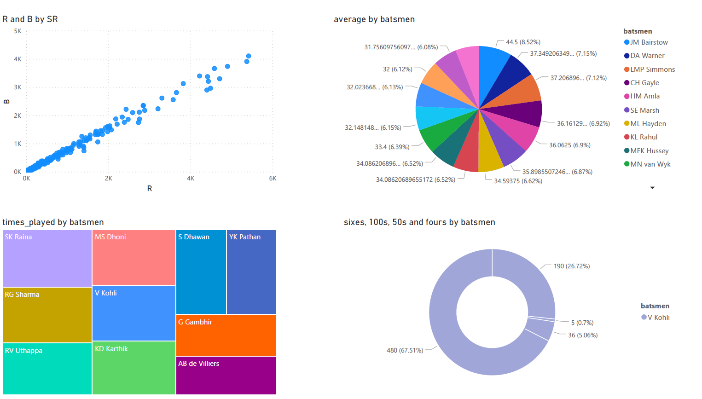
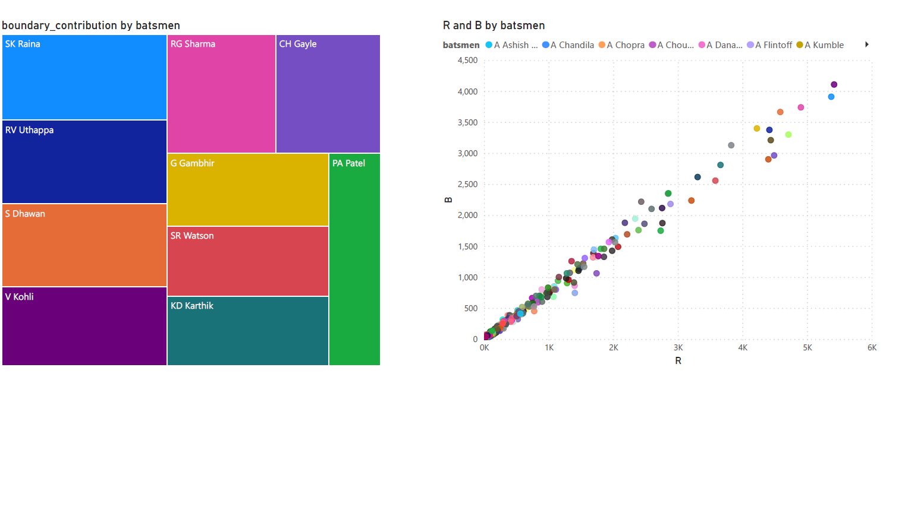

#### Insights
1. **Top Scorer**: Virat Kohli scored the maximum runs.
2. **Most 4s**: SK Raina hit the most fours.
3. **Most Centuries**: CH Gayle scored the most centuries.
4. **Correlation**: There is a notable correlation between runs (R) and balls faced (B) as measured by strike rate (SR).
